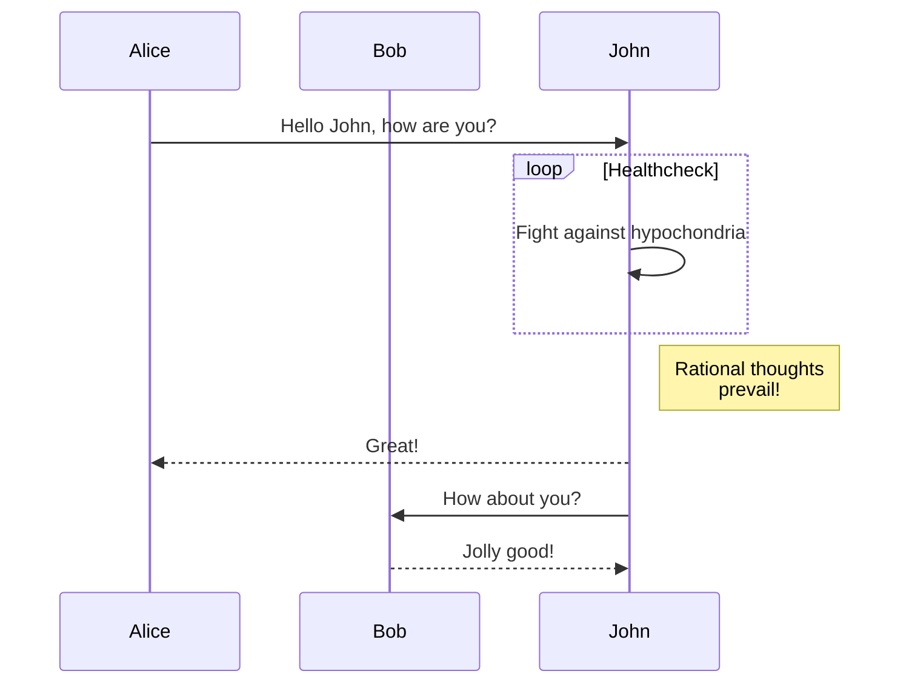
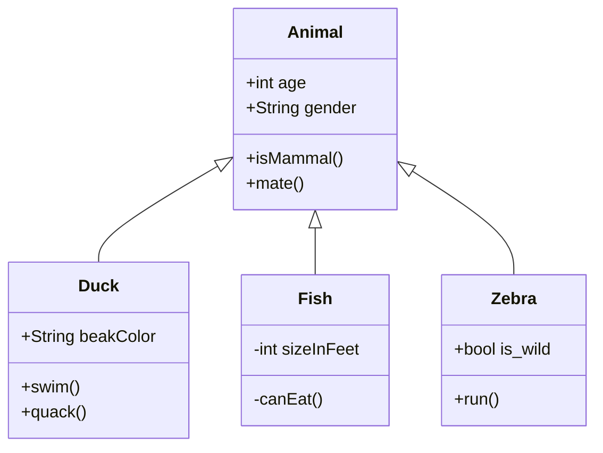

Scalable Graphics Format
========================

<svg height="200" id="testStaticDrawingSchemaA" width="500">
	<defs>
		<marker id="Arrow1Mend" orient="auto" refX="0.0" refY="0.0" style="overflow:visible;">
			<path d="M 0.0,0.0 L 5.0,-5.0 L -12.5,0.0 L 5.0,5.0 L 0.0,0.0 z " id="path5143" style="fill-rule:evenodd;stroke:#000000;stroke-width:1.0pt;" transform="scale(0.4) rotate(180) translate(10,0)"/>
		</marker>
	</defs>
	<g transform="translate(20,20)">
		<rect height="21" style="fill: rgb(232, 109, 31); stroke: rgb(0, 0, 0); stroke-width: 1px;" width="30"/>
		<text style="dominant-baseline: central; text-anchor: middle; font-size: 18px; font-weight: bold; font-family: Calibri;" x="15" y="10.5">a</text>
	</g>
	<g transform="translate(20,40)">
		<rect height="21" style="fill: rgb(232, 109, 31); stroke: rgb(0, 0, 0); stroke-width: 1px;" width="30"/>
		<text style="dominant-baseline: central; text-anchor: middle; font-size: 18px; font-weight: bold; font-family: Calibri;" x="15" y="10.5">b</text>
	</g>
	<g transform="translate(20,60)">
		<rect height="21" style="fill: rgb(232, 109, 31); stroke: rgb(0, 0, 0); stroke-width: 1px;" width="30"/>
		<text style="dominant-baseline: central; text-anchor: middle; font-size: 18px; font-weight: bold; font-family: Calibri;" x="15" y="10.5">c</text>
	</g>
	<g transform="translate(20,80)">
		<rect height="21" style="fill: rgb(232, 109, 31); stroke: rgb(0, 0, 0); stroke-width: 1px;" width="30"/>
		<text style="dominant-baseline: central; text-anchor: middle; font-size: 18px; font-weight: bold; font-family: Calibri;" x="15" y="10.5">B</text>
		<path d="m 30,10.5 30,0" style="stroke: rgb(0, 0, 0); stroke-width: 1px; stroke-opacity: 1; stroke-linecap: butt; stroke-linejoin: miter; marker-end: url(#Arrow1Mend);"/>
	</g>
</svg>

Mermaid
----

    

graph LR
    id1(This is the text in the box)

